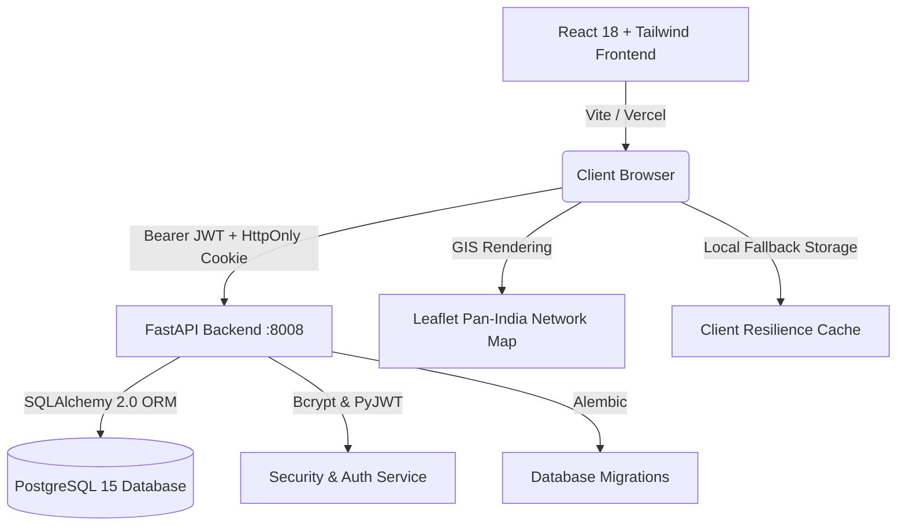

# 🚛 ROADSIDE LOGISTICS (RSL)
### Real-Time Pan-India Freight Capacity & Intelligent Corridor Platform

[](https://react.dev/)
[](https://fastapi.tiangolo.com/)
[](https://www.postgresql.org/)
[](https://www.docker.com/)
[](https://vercel.com/)

---

## 📌 Repository Overview & Pitch

**RoadSide Logistics** is an intelligent, high-density intermodal freight capacity network across India. It matches shippers with moving trucks already cruising national highway corridors, dramatically slashing deadhead miles, freight costs, and transit delays.

Combining **direction-aware smart hub handovers**, **dual-mode booking (Shared Space vs Full Vehicle Dedicated Fleet)**, **real-time Uber-style telemetry tracking**, and **production-grade PostgreSQL SaaS authentication**, RSL provides a comprehensive digital operating system for national freight.

---

## 🌟 Core System Features

### 1. 🇮🇳 Pan-India Intelligent Freight Corridors
- **National Highway Mesh**: Live coverage across **NH-44, NH-48, NH-16, NH-65, NH-19, NH-27, NH-52, and NH-544**.
- **Major Economic Hubs**: Delhi-NCR, Mumbai, Kolkata, Bengaluru, Chennai, Hyderabad, Ahmedabad, Pune, Surat, Jaipur, Lucknow, Nagpur, Indore, Kochi, Visakhapatnam, Bhubaneswar, Guwahati, and Ludhiana.
- **Interactive Dark Map**: Leaflet-powered GIS dashboard displaying live telemetry, corridor speeds, heading vectors, and smart cross-docking bays.

### 2. 🧭 Direction-Aware Smart Hub Selection
- **Prevents Reverse Detours**: Recommends only hubs and vehicles currently en route and heading towards the pickup point.
- **Strict Exclusion**: Automatically excludes trucks that have already passed the hub or are heading in the opposite direction.
- **Smart Hub Matching**: Identifies closest corridor entry gates with available dock bays and fast cross-docking.

### 3. 📦 Dual Booking Modes
| Feature | 📦 Mode 1: Share Capacity | 🚛 Mode 2: Full Dedicated Vehicle |
| :--- | :--- | :--- |
| **Use Case** | LTL / Partial loads (50 kg – 10 tonnes) | 100% Exclusive Truck Reservation |
| **Pricing** | Dynamic per-kg corridor rate | Fixed base rate + per-km distance rate |
| **Fleet Type** | Multi-Axle Trucks, Container Trucks | LCV (1.2T), Medium (5T), Heavy Multi-Axle (15T) |
| **Advantage** | Up to 40% cost reduction via shared space | Zero intermediate stops & no co-loaded cargo |

### 4. 📡 Live Shipment Tracking
- **Uber-Style Experience**: Real-time progress bar, milestone checkpoints, live distance/speed gauges, driver identification, and estimated arrival timestamp.
- **Multi-Status Lifecycle**: `AWAITING HUB PICKUP` $\rightarrow$ `IN TRANSIT ON CORRIDOR` $\rightarrow$ `OUT FOR DELIVERY` $\rightarrow$ `DELIVERED`.

### 5. 🔐 Production-Style SaaS Authentication & PostgreSQL Architecture
- **FastAPI Backend & SQLAlchemy ORM**: Real database-driven user storage with UUID primary keys.
- **Bcrypt Hashing**: Secure 72-byte salted password verification.
- **Dual-Token Architecture**: Short-lived JWT access tokens ($15\text{ mins}$) + server-managed rotating refresh sessions stored in PostgreSQL ($7\text{ days}$) with HttpOnly cookies.
- **Multi-Tenant SaaS Roles**: Supports `SHIPPER`, `FLEET_PARTNER`, and `LOGISTICS_COMPANY` organizations with `OWNER`, `ADMIN`, `FLEET_MANAGER`, and `MEMBER` roles.

---

## 🏗️ System Architecture



---

## 🗄️ Database Schema

- **`users`**: UUID PK, full_name, email (unique, indexed), phone, password_hash, is_active, is_verified, created_at.
- **`organizations`**: UUID PK, name, organization_type (`SHIPPER`, `FLEET_PARTNER`, `LOGISTICS_COMPANY`).
- **`organization_members`**: UUID PK, user_id (FK), organization_id (FK), role (`OWNER`, `ADMIN`, `MEMBER`, `FLEET_MANAGER`, `DISPATCHER`).
- **`refresh_sessions`**: UUID PK, user_id (FK), token_hash (SHA-256), user_agent, ip_address, expires_at, revoked_at.

---

## ⚡ Quick Start Guide

### Prerequisites
- Node.js 18+
- Python 3.11+ (or Docker Desktop)

### Option A: Run with Docker Compose (Recommended)
```bash
# 1. Start backend and PostgreSQL containers
cd backend
docker compose up -d

# 2. Seed initial demo user (demo@roadside.in / RoadSide123)
docker compose exec backend python init_db.py

# 3. Start frontend
cd ..
npm install
npm run dev
```

### Option B: Local Python Setup
```bash
# Backend
cd backend
python -m venv venv
.\venv\Scripts\activate
pip install -r requirements.txt
alembic upgrade head
python init_db.py
uvicorn app.main:app --host 0.0.0.0 --port 8008 --reload

# Frontend (in another terminal)
cd roadside-logistics
npm install
npm run dev
```

- **Frontend App**: `http://localhost:5173`
- **FastAPI Swagger API Docs**: `http://localhost:8008/docs`

---

## 🌐 Deploy to Vercel

```bash
npx vercel --prod
```

---

## 📄 License
MIT License © 2026 RoadSide Logistics Technologies.
